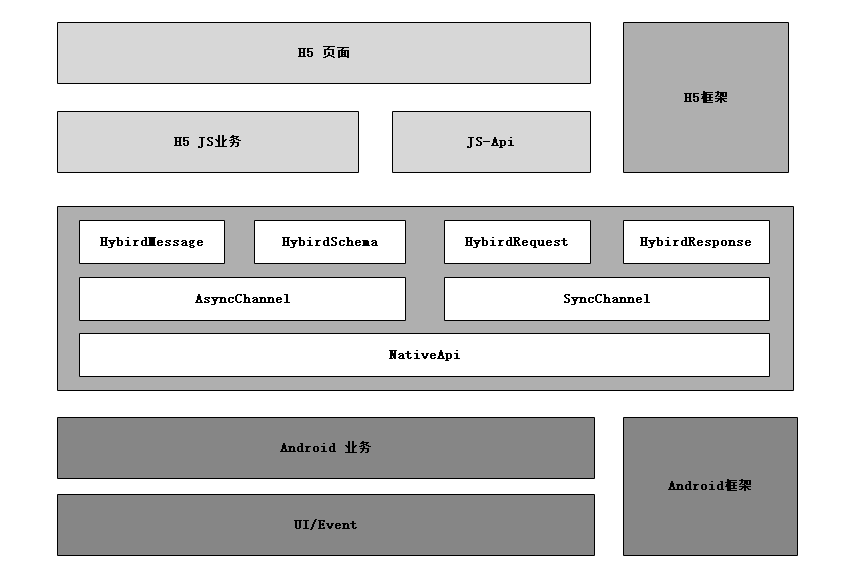
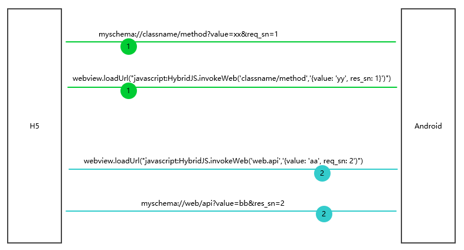

## 目录
* 方案
	* 架构方案（Hybrid）
	* 通讯方案（HybridBridge）
* 架构	
	* 应该架构 （MVVM）
	* Hybrid架构
* 设计
	* JavaScript Call Android
	* Android Call JavaScript
* 结构树
	* HybridWebView
	* HybridBridge
* 类介绍
	* 
* 使用示例
	* HybridWebView使用
	* HybridBridge使用
	* 框架使用

### 方案
#### 架构方案（Hybrid）




### 架构
### 设计
#### 调用大致设计流程
- Android调用js
    - 调用callHandler方法，然后将方法中的三个属性封装到HybridMessage对象中。如果用户传递callback不为空，则添加到map集合中
    - 然后开始分发数据，把这些先都添加到list集合中。那么何时调用呢？
    - 然后看一下WebViewClient类的onPageFinished，获取list集合，然后遍历依次调用dispatchMessage处理事件。注意这里借助了handler发送到主线程队列中处理
- js调用Android
    - 调用registerHandler方法，设置Android方法和handler存放到messageHandlers集合中。那么那个地方去获取集合信息，然后处理事件呢？
    - 然后在shouldOverrideUrlLoading方法中，拦截url是否是自己定义的scheme，则开始分发消息
#### HybridWebView基础使用
##### 01.常用的基础使用介绍
- 在activity中最简单的使用
    ```kotlin
   val webView: HybridWebView = HybridWebView(this) {
            isOpenJavascript = true
            isDebugEnable = true
        }.loadLocalUrl("file:///android_asset/hybrid.html")          //加载本地资源
         .loadRemoteUrl("http://www.baidu.com/","router")            //加载web资源
    //这个时候发现一个问题，启动应用后，自动的打开了系统内置的浏览器，解决这个问题需要为webview设置 WebViewClient，并重写方法：
    ```
- 那些因素影响页面加载速度
    - 影响页面加载速度的因素有非常多，在对 WebView  加载一个网页的过程进行调试发现
        - 每次加载的过程中都会有较多的网络请求，除了 web 页面自身的 URL 请求
        - 有 web 页面外部引用的JS、CSS、字体、图片等等都是个独立的http请求。这些请求都是串行的，这些请求加上浏览器的解析、渲染时间就会导致 WebView 整体加载时间变长，消耗的流量也对应的真多。


##### 02.清除缓存和缓存分析
- 清除缓存数据的方法有哪些？
    ```kotlin
    //清除网页访问留下的缓存
    //由于内核缓存是全局的因此这个方法不仅仅针对webview而是针对整个应用程序.
    webView.clearWebViewCache()
    ```
- WebView缓存是在什么地方？
    - 在项目中如果使用到 WebView 控件,当加载 html 页面时,会在/data/data/包名目录下生成 database 与 cache 两个文件夹。
    - 请求的 url 记录是保存在 WebViewCache.db,而 url 的内容是保存在 WebViewCache 文件夹下。
- 多种缓存策略分析
    - LOAD_CACHE_ONLY：不使用网络，只读本地缓存。
    - LOAD_NORMAL：在 API Level 17 中已经被废弃，而在API Level 11 开始，策略如 LOAD_DEFALT。
    - LOAD_NO_CACHE：不使用缓存，只从网络获取数据。
    - LOAD_CACHE_ELSE_NETWORK：只要本地有缓存，就从缓存中读取数据。
    - LOAD_DEFAULT：根据 Http 协议，决定是否从网络获取数据。


### 结构树
### 类介绍
### 使用示例